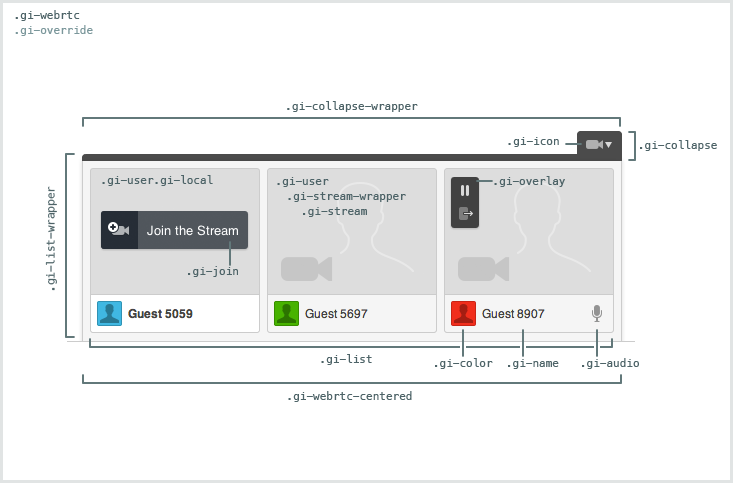

# Audio and Video

[Github Link](html/webrtc_github.html "include")

[Github Link](html/webrtc_intro.html "include")

## Features
- Join or leave the conference at the user's convenience
- Pause and resume your video stream at any time
- Mute and unmute your audio stream at any time
- Displays an indicator when a user is speaking
- Expand a user to a separate container to enlarge their stream
- Collapse the list of users and their streams

## Supported Browsers
The WebRTC widget currently supports the latest versions of FireFox and Chrome.

## User Data
- The name for a user is pulled from the  `displayName` key on the [userObject](../../javascript_api/users.html)
- The color for a user is pulled from the `avatarColor` key on the [userObject](../../javascript_api/users.html)

## Table of Contents

1. [Code Example](#code-example)
1. [HTML](#html)
1. [CSS](#css)
1. [Constructor](#constructor)
1. [WebRTC#initialize](#webrtc#initialize)
1. [WebRTC#destroy](#webrtc#destroy)
1. [Related Information](#related-information)

## Code Example

### 1. Include our CDN assets:

#### Note on Versioning

Specific version of widgets can be found on our [CDN](https://cdn.goinstant.net/).

```html
<script type="text/javascript" src="https://cdn.goinstant.net/v1/platform.min.js"></script>
<script type="text/javascript" src="https://cdn.goinstant.net/widgets/webrtc/latest/webrtc.min.js"></script>
<!-- CSS is optional -->
<link rel="stylesheet" href="https://cdn.goinstant.net/widgets/webrtc/latest/webrtc.css" />
```

```js
// Connect URL
var url = 'https://goinstant.net/YOURACCOUNT/YOURAPP';

// Connect to GoInstant
goinstant.connect(url, function(err, platformObj, roomObj) {
  if (err) {
    throw err;
  }

  // Create a new instance of the WebRTC widget
  var webrtc = new goinstant.widgets.WebRTC({
    room: roomObj
  });

  // Initialize the WebRTC widget
  webrtc.initialize(function(err) {
    if (err) {
      throw err;
    }
    // The widget should now be rendered on the page
  });
});
```

## HTML

### WebRTC

The widget is rendered to a `div` that is appended to page body after `#initialize` has successfully completed.
There are two main child elements in the WebRTC widget: `.gi-list-wrapper` and `.gi-collapse-wrapper`.
The `.gi-list-wrapper` div contains the list of users and their streams (`.gi-user`).
The `.gi-collapse-wrapper` div is a container for the collapse button.

```html
<div class="gi-webrtc">
  <div class="gi-webrtc-centered">
    <div class="gi-collapse-wrapper">
      <div class="gi-collapse">
        <span class="gi-icon"></span>
      </div>
    </div>
    <div class="gi-list-wrapper">
      <ul class="gi-list"></ul>
    </div>
  </div>
</div>
```

### User Element

Each user (`.gi-user`) is a list item (`li`) appended to an unordered list (`.gi-list`).
There are two child elements for each user: `.gi-stream-wrapper` and `.gi-user-wrapper`.
The `.gi-stream-wrapper` div displays the video stream and video controls (.'gi-overlay').
The `.gi-user-wrapper` div displays the user's displayName (`.gi-name`),
avatarColor (`.gi-color`), and the voice indicator/controls ('.gi-audio').

```html
<li class="gi-user">
  <div class="gi-stream-wrapper">
    <div class="gi-overlay">
      <div class="gi-expand">
        <span class="gi-icon"></span>
      </div>
    </div>
  </div>
  <div class="gi-user-wrapper">
    <div class="gi-color">
      <div class="gi-avatar"></div>
    </div>
    <span class="gi-name"></span>
    <div class="gi-audio">
      <span class="gi-icon"></span>
    </div>
  </div>
</li>
```

Note the local user element is displayed at the front of the list with a
unique `.gi-local` class on the list item.

## CSS

### Note on gi-override

Each class is prefixed with `gi` to avoid conflicts.  The top-level container
also has a `.gi-override` class. Our goal is to make each widget as easy as
possible to customize.

If you have not included our CSS file, you do not need to use the `gi-override`
class when styling the widget.



This stylesheet provides a good starting point for customizing the WebRTC widget.

```css
.gi-webrtc.gi-override {
  /* Add custom styles */
}

.gi-webrtc.gi-override .gi-list {
  /* Add custom styles */
}

.gi-webrtc.gi-override .gi-user {
  /* Add custom styles */
}

.gi-webrtc.gi-override .gi-user .gi-user-wrapper {
  /* Add custom styles */
}

.gi-webrtc.gi-override .gi-user .gi-stream-wrapper {
  /* Add custom styles */
}

.gi-webrtc.gi-override .gi-user .gi-stream {
/* Add custom styles */
}

.gi-webrtc.gi-override .gi-user .gi-stream-wrapper .gi-overlay {
  /* Add custom styles */
}

.gi-webrtc.gi-override .gi-avatar {
  /* Add custom styles */
}

.gi-webrtc.gi-override .gi-avatar .gi-avatar-img {
  /* Add custom styles */
}

.gi-webrtc.gi-override .gi-color {
  /* Add custom styles */
}

.gi-webrtc.gi-override .gi-name {
  /* Add custom styles */
}

.gi-webrtc.gi-override .gi-user .gi-audio {
  /* Add custom styles */
}

.gi-webrtc.gi-override .gi-join {
  /* Add custom styles */
}

.gi-webrtc.gi-override .gi-join .gi-icon {
  /* Add custom styles */
}

.gi-webrtc.gi-override .gi-collapse-wrapper {
  /* Add custom styles */
}

.gi-webrtc.gi-override .gi-collapse {
  /* Add custom styles */
}

.gi-webrtc.gi-override .gi-icon {
  /* Add custom styles */
}

.gi-webrtc.gi-override.gi-expand-container .gi-stream-wrapper {
  /* Add custom styles */
}
```

## Constructor

Creates the WebRTC instance with customizable options.

### Methods

- ###### **new WebRTC(optionsObject)**

### Parameters

| optionsObject |
|:---|
| Type: [Object](https://developer.mozilla.org/en-US/docs/Web/JavaScript/Reference/Global_Objects/Object) |
| An object with the following properties: |
| - `room` is the [Room](../../javascript_api/rooms/index.html).|
| - `listContainer` is an optional DOM element that, if provided, the WebRTC user list will render in.|
| - `expandContainer` is an optional DOM element that, if provided, enables the expand user control and renders expanded users in the given container.|
| - `collapsed` [**default: false**] is a [Boolean](https://developer.mozilla.org/en-US/docs/Web/JavaScript/Reference/Global_Objects/Boolean) where, if true, the WebRTC widget will be initially rendered collapsed.|

### Example

```js
var options = {
  room: exampleRoom,
  listContainer: document.getElementById('myListContainer'),
  expandContainer: document.getElementById('myExpandContainer'),
  collapsed: true
};

var webrtc = new goinstant.widget.WebRTC(options);
```

## WebRTC#initialize

Creates a new instance of the WebRTC widget

### Methods

- ###### **webrtc.initialize(callback(errorObject))**

### Parameters

| callback(errorObject) |
|:---|
| Type: [Function](https://developer.mozilla.org/en-US/docs/Web/JavaScript/Reference/Global_Objects/Function) |
| A callback function that is called once the webrtc widget has completed being initialized. |
| - `errorObject` - will be null, unless an error has occurred. |

### Example

```js
webrtc.initialize(function(err) {
  // ready
});
```

## WebRTC#destroy

Destroys the WebRTC widget

### Methods

- ###### **webrtc.destroy(callback(errorObject))**

### Parameters

| callback(errorObject) |
|:---|
| Type: [Function](https://developer.mozilla.org/en-US/docs/Web/JavaScript/Reference/Global_Objects/Function) |
| A callback function that is returned once the webrtc widget has completed being destroyed. |
| - `errorObject` - will be null, unless an error has occurred. |

### Example
```js
webrtc.destroy(function(err) {
  // done
});
```

## Related Information

### How do I customize user colors?

See the [colors guide](../guides/colors.html).

